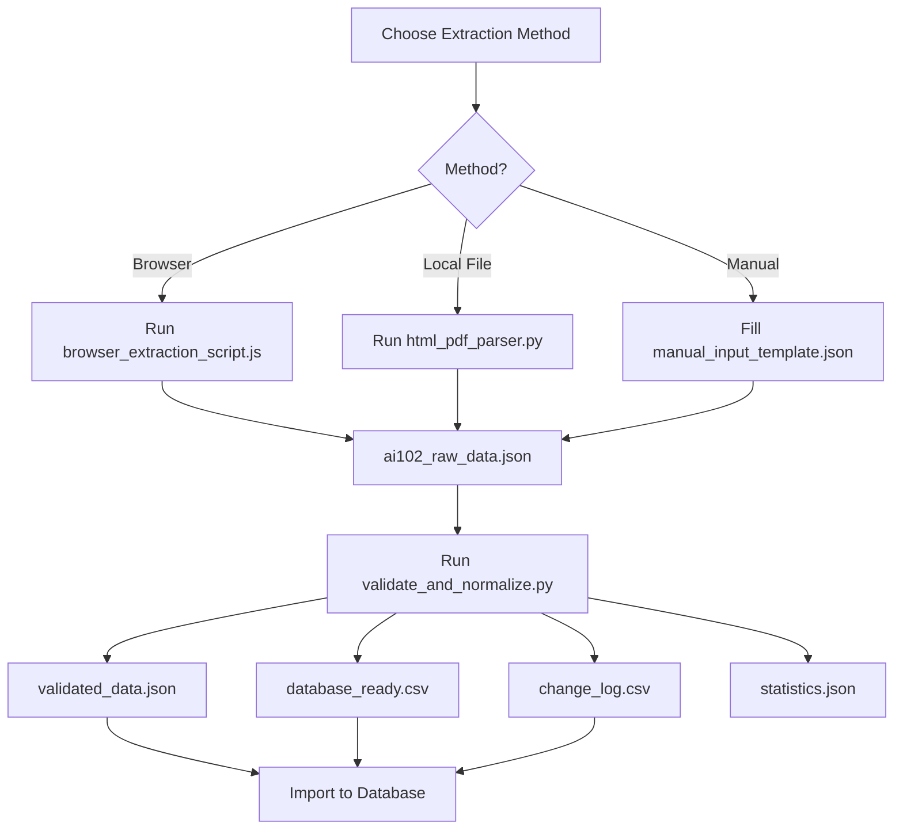

# AI-102 Study Guide Extraction & Structuring Tool

Complete toolkit for extracting, validating, and normalizing Microsoft AI-102 exam study guide content into machine-readable formats for database ingestion and gamification.

## 📋 Table of Contents

- [Quick Start](#quick-start)
- [Method 1: Browser Extraction](#method-1-browser-extraction)
- [Method 2: HTML/PDF Parser](#method-2-htmlpdf-parser)
- [Method 3: Manual Input](#method-3-manual-input)
- [Validation & Normalization](#validation--normalization)
- [Output Formats](#output-formats)
- [Database Integration](#database-integration)
- [Troubleshooting](#troubleshooting)

---

## 🚀 Quick Start

### Prerequisites

```bash
# For Python scripts
pip install beautifulsoup4 PyPDF2 jsonschema

# Or install all at once
pip install -r requirements.txt
```

### Three Extraction Methods

**Choose the method that works best for you:**

1. **Browser Extraction** - Run JavaScript in your browser console (easiest)
2. **HTML/PDF Parser** - Parse saved HTML or PDF files locally
3. **Manual Input** - Copy/paste content into JSON template

---

## Method 1: Browser Extraction

**Most Reliable Method - Recommended**

### Steps:

1. Open the AI-102 study guide in your browser:
   ```
   https://learn.microsoft.com/en-us/credentials/certifications/resources/study-guides/ai-102
   ```

2. Open Developer Tools:
   - **Windows/Linux**: Press `F12` or `Ctrl+Shift+I`
   - **Mac**: Press `Cmd+Option+I`

3. Go to the **Console** tab

4. Copy the entire contents of `browser_extraction_script.js`

5. Paste into the console and press **Enter**

6. The script will:
   - Extract all content
   - Display JSON in the console
   - Attempt to download `ai102_raw_data.json` automatically

7. If auto-download fails, copy the JSON from console output

8. Save to file: `ai102_raw_data.json`

### What Gets Extracted:

- ✅ All topic areas with percentage weights
- ✅ All skills and sub-skills
- ✅ Reference links embedded in the page
- ✅ Change log section
- ✅ Exam metadata (title, update date)

---

## Method 2: HTML/PDF Parser

**For Offline Processing**

### Steps:

1. **Save the study guide page:**
   - In browser: `File > Save As > Webpage, Complete`
   - Or: Print to PDF

2. **Run the parser:**

   ```bash
   # For HTML file
   python html_pdf_parser.py study_guide.html

   # For PDF file
   python html_pdf_parser.py study_guide.pdf
   ```

3. **Output:** `ai102_structured_data.json`

### Features:

- Automatically detects file type
- Extracts hierarchical structure
- Preserves links and metadata
- Generates summary statistics

### Expected Output:

```
Parsing study_guide.html...

✓ Extraction complete!
✓ Topic areas found: 6
✓ Change log entries: 5
✓ Output saved to: ai102_structured_data.json

=== TOPIC AREAS ===
  • Plan and manage an Azure AI solution (20-25%)
    Skills: 4
    Sub-skills: 23
  ...
```

---

## Method 3: Manual Input

**For Direct Copy/Paste**

### Steps:

1. Open `manual_input_template.json`

2. Fill in the structure by copying from the study guide:

   ```json
   {
     "topic_areas": [
       {
         "topic_area": "Topic name from page",
         "percentage_weight": "20-25%",
         "skills": [
           {
             "skill": "Skill name from page",
             "sub_skills": [
               {
                 "sub_skill": "Exact bullet point text",
                 "reference_links": ["URL if provided"],
                 "annotation": ""
               }
             ]
           }
         ]
       }
     ]
   }
   ```

3. Save your completed file

4. Proceed to validation step

---

## Validation & Normalization

**Required Step for All Methods**

After extraction, validate and normalize your data:

```bash
python validate_and_normalize.py ai102_raw_data.json
```

### This Process:

1. **Validates** against JSON schema
2. **Adds unique IDs** to all elements
3. **Normalizes** data structure
4. **Exports** to multiple formats
5. **Generates** statistics

### Output Files:

- `validated_data.json` - Clean, normalized JSON
- `database_ready.csv` - Flattened for database import
- `change_log.csv` - Change log in tabular format
- `statistics.json` - Dataset statistics

### Sample Output:

```
✓ Validation passed!
✓ Normalization complete!
✓ Saved: validated_data.json
✓ Saved: database_ready.csv
✓ Saved: change_log.csv

=== STATISTICS ===
Total Topic Areas: 6
Total Skills: 24
Total Sub-Skills: 145
Total Reference Links: 87

=== TOPIC BREAKDOWN ===
Plan and manage an Azure AI solution (20-25%)
  Skills: 4
  Sub-skills: 23
...
```

---

## 📊 Output Formats

### 1. JSON Format (validated_data.json)

```json
{
  "metadata": {
    "exam_code": "AI-102",
    "exam_title": "Designing and Implementing a Microsoft Azure AI Solution",
    "extraction_date": "2025-11-23T...",
    "exam_update_date": "April 2025"
  },
  "topic_areas": [
    {
      "topic_id": "TOPIC-001",
      "topic_area": "Plan and manage an Azure AI solution",
      "percentage_weight": "20-25%",
      "skills": [
        {
          "skill_id": "SKILL-0001",
          "topic_id": "TOPIC-001",
          "skill": "Select the appropriate Azure AI Foundry services",
          "sub_skills": [
            {
              "sub_skill_id": "SUBSKILL-00001",
              "skill_id": "SKILL-0001",
              "topic_id": "TOPIC-001",
              "sub_skill": "Select the appropriate service for a generative AI solution",
              "reference_links": ["https://..."],
              "annotation": ""
            }
          ]
        }
      ]
    }
  ],
  "change_log": [...]
}
```

### 2. CSV Format (database_ready.csv)

| sub_skill_id | skill_id | topic_id | topic_area | percentage_weight | skill | sub_skill | reference_links | annotation |
|--------------|----------|----------|------------|-------------------|-------|-----------|-----------------|------------|
| SUBSKILL-00001 | SKILL-0001 | TOPIC-001 | Plan and manage... | 20-25% | Select the appropriate... | Select the appropriate service... | https://... | |

### 3. Change Log CSV (change_log.csv)

| change_id | change_description | change_date | change_type |
|-----------|-------------------|-------------|-------------|
| CHANGE-001 | Azure AI Foundry is now... | April 2025 | Major |

---

## 🗄️ Database Integration

### SQL Schema

```sql
-- Topic Areas Table
CREATE TABLE topic_areas (
    topic_id VARCHAR(20) PRIMARY KEY,
    topic_area VARCHAR(255) NOT NULL,
    percentage_weight VARCHAR(20)
);

-- Skills Table
CREATE TABLE skills (
    skill_id VARCHAR(20) PRIMARY KEY,
    topic_id VARCHAR(20),
    skill VARCHAR(500) NOT NULL,
    FOREIGN KEY (topic_id) REFERENCES topic_areas(topic_id)
);

-- Sub-Skills Table
CREATE TABLE sub_skills (
    sub_skill_id VARCHAR(20) PRIMARY KEY,
    skill_id VARCHAR(20),
    topic_id VARCHAR(20),
    sub_skill TEXT NOT NULL,
    reference_links TEXT,
    annotation TEXT,
    FOREIGN KEY (skill_id) REFERENCES skills(skill_id),
    FOREIGN KEY (topic_id) REFERENCES topic_areas(topic_id)
);

-- Change Log Table
CREATE TABLE change_log (
    change_id VARCHAR(20) PRIMARY KEY,
    change_description TEXT,
    change_date VARCHAR(50),
    change_type VARCHAR(20)
);
```

### Import to PostgreSQL

```bash
# Import CSV files
psql -U username -d database_name

\copy topic_areas FROM 'topic_areas.csv' CSV HEADER;
\copy skills FROM 'skills.csv' CSV HEADER;
\copy sub_skills FROM 'database_ready.csv' CSV HEADER;
\copy change_log FROM 'change_log.csv' CSV HEADER;
```

### Import to MongoDB

```bash
mongoimport --db ai102 --collection study_guide --file validated_data.json
```

### Import to SQLite

```python
import sqlite3
import pandas as pd

# Read CSV
df = pd.read_csv('database_ready.csv')

# Create connection
conn = sqlite3.connect('ai102.db')

# Import
df.to_sql('sub_skills', conn, if_exists='replace', index=False)
```

---

## 🎮 Gamification Fields

Each sub-skill includes an `annotation` field for gamification:

```json
{
  "sub_skill": "Select the appropriate service...",
  "annotation": "completed|in_progress|not_started|mastered"
}
```

### Example Gamification Schema:

```json
{
  "annotation": {
    "status": "completed",
    "confidence_level": 4,
    "last_reviewed": "2025-11-20",
    "attempts": 3,
    "correct_answers": 2,
    "notes": "Need to review deployment options"
  }
}
```

---

## 🔧 Troubleshooting

### Issue: Browser script fails

**Solution:**
- Ensure you're on the correct page
- Check console for errors
- Try refreshing the page
- Use Method 2 (HTML parser) instead

### Issue: Validation errors

**Solution:**
```bash
# Check what's wrong
python validate_and_normalize.py your_file.json

# Common fixes:
# - Ensure all required fields are present
# - Check JSON syntax with: python -m json.tool your_file.json
# - Verify percentage_weight format: "20-25%"
```

### Issue: Missing content

**Solution:**
- Compare extracted data with source page
- Check if page structure has changed
- Manually add missing items to JSON
- Re-run validation

### Issue: Python dependencies

**Solution:**
```bash
pip install beautifulsoup4 PyPDF2 jsonschema
```

---

## 📁 File Structure

```
AI_102_STUDY_FOCUS/
├── browser_extraction_script.js   # Browser console script
├── html_pdf_parser.py             # HTML/PDF parser
├── validate_and_normalize.py      # Validation & normalization
├── schema.json                    # JSON schema
├── manual_input_template.json     # Manual input template
├── requirements.txt               # Python dependencies
├── EXTRACTION_GUIDE.md           # This file
└── README.md                     # Project overview
```

---

## 🎯 Complete Workflow



---

## ✅ Quality Checklist

Before considering extraction complete:

- [ ] All 6 topic areas extracted
- [ ] Percentage weights captured for each topic
- [ ] All skills listed under correct topics
- [ ] All sub-skills (bullet points) captured
- [ ] Reference links preserved where available
- [ ] Change log section extracted
- [ ] Metadata fields populated
- [ ] Validation passes without errors
- [ ] CSV files generated successfully
- [ ] Statistics look reasonable

---

## 📞 Support

If you encounter issues:

1. Check the troubleshooting section
2. Verify Python dependencies are installed
3. Ensure you're using the latest version of the scripts
4. Check that the Microsoft study guide page structure hasn't changed

---

## 📄 License

This extraction toolkit is provided as-is for educational purposes.

The AI-102 exam content is © Microsoft Corporation.
